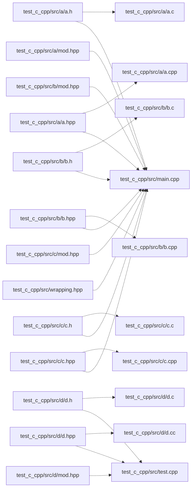
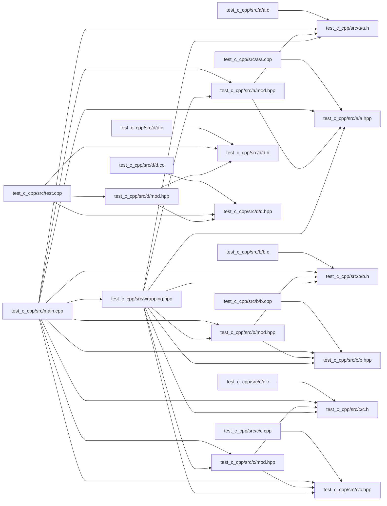

```mermaid
flowchart LR;
    test_c_cpp/src/a/a.h -.-> test_c_cpp/src/a/a.c;
    test_c_cpp/src/a/a.h -.-> test_c_cpp/src/main.cpp;
    test_c_cpp/src/a/a.hpp -.-> test_c_cpp/src/a/a.cpp;
    test_c_cpp/src/a/a.hpp -.-> test_c_cpp/src/main.cpp;
    test_c_cpp/src/a/mod.hpp -.-> test_c_cpp/src/main.cpp;
    test_c_cpp/src/b/b.h -.-> test_c_cpp/src/b/b.c;
    test_c_cpp/src/b/b.h -.-> test_c_cpp/src/main.cpp;
    test_c_cpp/src/b/b.hpp -.-> test_c_cpp/src/b/b.cpp;
    test_c_cpp/src/b/b.hpp -.-> test_c_cpp/src/main.cpp;
    test_c_cpp/src/b/mod.hpp -.-> test_c_cpp/src/main.cpp;
    test_c_cpp/src/c/c.h -.-> test_c_cpp/src/c/c.c;
    test_c_cpp/src/c/c.h -.-> test_c_cpp/src/main.cpp;
    test_c_cpp/src/c/c.hpp -.-> test_c_cpp/src/c/c.cpp;
    test_c_cpp/src/c/c.hpp -.-> test_c_cpp/src/main.cpp;
    test_c_cpp/src/c/mod.hpp -.-> test_c_cpp/src/main.cpp;
    test_c_cpp/src/d/d.h -.-> test_c_cpp/src/d/d.c;
    test_c_cpp/src/d/d.h -.-> test_c_cpp/src/test.cpp;
    test_c_cpp/src/d/d.hpp -.-> test_c_cpp/src/d/d.cc;
    test_c_cpp/src/d/d.hpp -.-> test_c_cpp/src/test.cpp;
    test_c_cpp/src/d/mod.hpp -.-> test_c_cpp/src/test.cpp;
    test_c_cpp/src/wrapping.hpp -.-> test_c_cpp/src/main.cpp;
```

```mermaid
flowchart LR;
    test_c_cpp/src/a/a.c ---> test_c_cpp/src/a/a.h;
    test_c_cpp/src/a/a.cpp ---> test_c_cpp/src/a/a.hpp;
    test_c_cpp/src/b/b.c ---> test_c_cpp/src/b/b.h;
    test_c_cpp/src/b/b.cpp ---> test_c_cpp/src/b/b.hpp;
    test_c_cpp/src/c/c.c ---> test_c_cpp/src/c/c.h;
    test_c_cpp/src/c/c.cpp ---> test_c_cpp/src/c/c.hpp;
    test_c_cpp/src/d/d.c ---> test_c_cpp/src/d/d.h;
    test_c_cpp/src/d/d.cc ---> test_c_cpp/src/d/d.hpp;
    test_c_cpp/src/main.cpp ---> test_c_cpp/src/a/a.h;
    test_c_cpp/src/main.cpp ---> test_c_cpp/src/a/a.hpp;
    test_c_cpp/src/main.cpp ---> test_c_cpp/src/a/mod.hpp;
    test_c_cpp/src/main.cpp ---> test_c_cpp/src/b/b.h;
    test_c_cpp/src/main.cpp ---> test_c_cpp/src/b/b.hpp;
    test_c_cpp/src/main.cpp ---> test_c_cpp/src/b/mod.hpp;
    test_c_cpp/src/main.cpp ---> test_c_cpp/src/c/c.h;
    test_c_cpp/src/main.cpp ---> test_c_cpp/src/c/c.hpp;
    test_c_cpp/src/main.cpp ---> test_c_cpp/src/c/mod.hpp;
    test_c_cpp/src/main.cpp ---> test_c_cpp/src/wrapping.hpp;
    test_c_cpp/src/test.cpp ---> test_c_cpp/src/d/d.h;
    test_c_cpp/src/test.cpp ---> test_c_cpp/src/d/d.hpp;
    test_c_cpp/src/test.cpp ---> test_c_cpp/src/d/mod.hpp;
    test_c_cpp/src/a/mod.hpp ---> test_c_cpp/src/a/a.h;
    test_c_cpp/src/a/mod.hpp ---> test_c_cpp/src/a/a.hpp;
    test_c_cpp/src/b/mod.hpp ---> test_c_cpp/src/b/b.h;
    test_c_cpp/src/b/mod.hpp ---> test_c_cpp/src/b/b.hpp;
    test_c_cpp/src/c/mod.hpp ---> test_c_cpp/src/c/c.h;
    test_c_cpp/src/c/mod.hpp ---> test_c_cpp/src/c/c.hpp;
    test_c_cpp/src/d/mod.hpp ---> test_c_cpp/src/d/d.h;
    test_c_cpp/src/d/mod.hpp ---> test_c_cpp/src/d/d.hpp;
    test_c_cpp/src/wrapping.hpp ---> test_c_cpp/src/a/a.h;
    test_c_cpp/src/wrapping.hpp ---> test_c_cpp/src/a/a.hpp;
    test_c_cpp/src/wrapping.hpp ---> test_c_cpp/src/a/mod.hpp;
    test_c_cpp/src/wrapping.hpp ---> test_c_cpp/src/b/b.h;
    test_c_cpp/src/wrapping.hpp ---> test_c_cpp/src/b/b.hpp;
    test_c_cpp/src/wrapping.hpp ---> test_c_cpp/src/b/mod.hpp;
    test_c_cpp/src/wrapping.hpp ---> test_c_cpp/src/c/c.h;
    test_c_cpp/src/wrapping.hpp ---> test_c_cpp/src/c/c.hpp;
    test_c_cpp/src/wrapping.hpp ---> test_c_cpp/src/c/mod.hpp;
```
