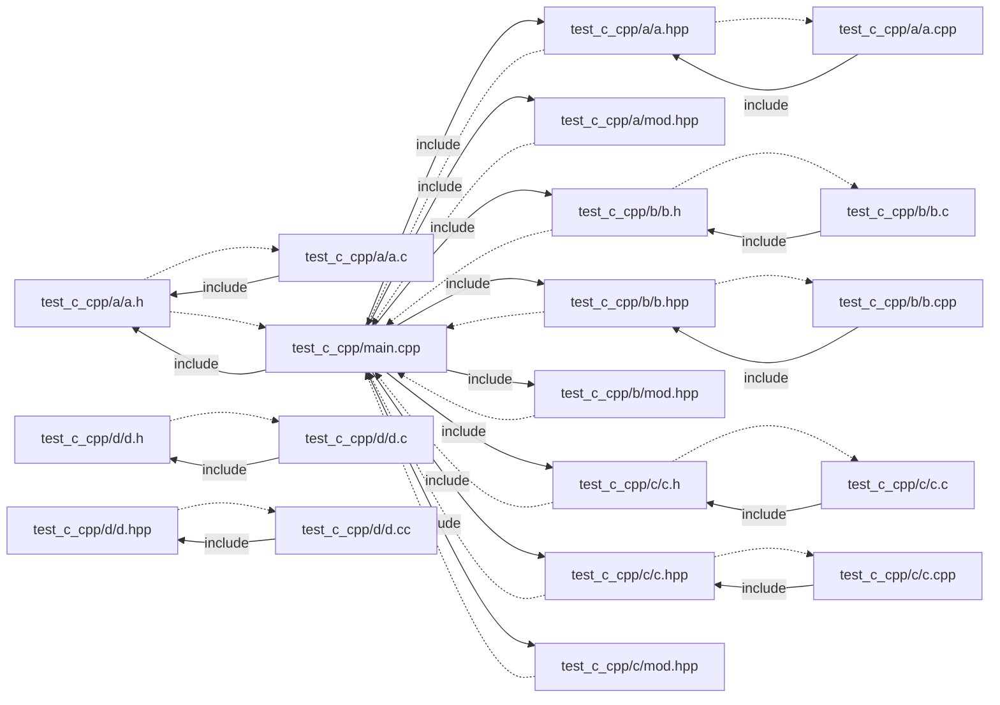

```mermaid
flowchart LR;
    test_c_cpp/a/a.h -.-> test_c_cpp/a/a.c;
    test_c_cpp/a/a.h -.-> test_c_cpp/main.cpp;
    test_c_cpp/a/a.hpp -.-> test_c_cpp/a/a.cpp;
    test_c_cpp/a/a.hpp -.-> test_c_cpp/main.cpp;
    test_c_cpp/a/mod.hpp -.-> test_c_cpp/main.cpp;
    test_c_cpp/b/b.h -.-> test_c_cpp/b/b.c;
    test_c_cpp/b/b.h -.-> test_c_cpp/main.cpp;
    test_c_cpp/b/b.hpp -.-> test_c_cpp/b/b.cpp;
    test_c_cpp/b/b.hpp -.-> test_c_cpp/main.cpp;
    test_c_cpp/b/mod.hpp -.-> test_c_cpp/main.cpp;
    test_c_cpp/c/c.h -.-> test_c_cpp/c/c.c;
    test_c_cpp/c/c.h -.-> test_c_cpp/main.cpp;
    test_c_cpp/c/c.hpp -.-> test_c_cpp/c/c.cpp;
    test_c_cpp/c/c.hpp -.-> test_c_cpp/main.cpp;
    test_c_cpp/c/mod.hpp -.-> test_c_cpp/main.cpp;
    test_c_cpp/d/d.h -.-> test_c_cpp/d/d.c;
    test_c_cpp/d/d.hpp -.-> test_c_cpp/d/d.cc;
    test_c_cpp/a/a.c -- include --> test_c_cpp/a/a.h;
    test_c_cpp/a/a.cpp -- include --> test_c_cpp/a/a.hpp;
    test_c_cpp/b/b.c -- include --> test_c_cpp/b/b.h;
    test_c_cpp/b/b.cpp -- include --> test_c_cpp/b/b.hpp;
    test_c_cpp/c/c.c -- include --> test_c_cpp/c/c.h;
    test_c_cpp/c/c.cpp -- include --> test_c_cpp/c/c.hpp;
    test_c_cpp/d/d.c -- include --> test_c_cpp/d/d.h;
    test_c_cpp/d/d.cc -- include --> test_c_cpp/d/d.hpp;
    test_c_cpp/main.cpp -- include --> test_c_cpp/a/a.h;
    test_c_cpp/main.cpp -- include --> test_c_cpp/a/a.hpp;
    test_c_cpp/main.cpp -- include --> test_c_cpp/a/mod.hpp;
    test_c_cpp/main.cpp -- include --> test_c_cpp/b/b.h;
    test_c_cpp/main.cpp -- include --> test_c_cpp/b/b.hpp;
    test_c_cpp/main.cpp -- include --> test_c_cpp/b/mod.hpp;
    test_c_cpp/main.cpp -- include --> test_c_cpp/c/c.h;
    test_c_cpp/main.cpp -- include --> test_c_cpp/c/c.hpp;
    test_c_cpp/main.cpp -- include --> test_c_cpp/c/mod.hpp;
```