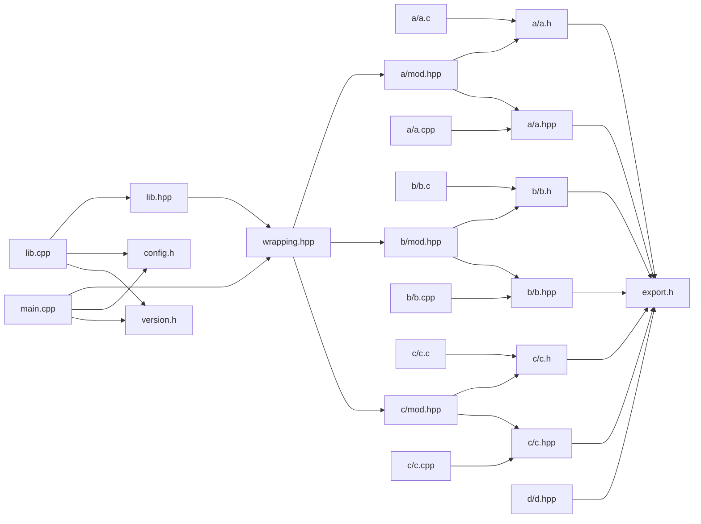

```mermaid
flowchart LR;
    a/a.c ---> a/a.h;
    a/mod.hpp ---> a/a.h;
    a/a.cpp ---> a/a.hpp;
    a/mod.hpp ---> a/a.hpp;
    wrapping.hpp ---> a/mod.hpp;
    b/b.c ---> b/b.h;
    b/mod.hpp ---> b/b.h;
    b/b.cpp ---> b/b.hpp;
    b/mod.hpp ---> b/b.hpp;
    wrapping.hpp ---> b/mod.hpp;
    c/c.c ---> c/c.h;
    c/mod.hpp ---> c/c.h;
    c/c.cpp ---> c/c.hpp;
    c/mod.hpp ---> c/c.hpp;
    wrapping.hpp ---> c/mod.hpp;
    a/a.h ---> export.h;
    a/a.hpp ---> export.h;
    b/b.h ---> export.h;
    b/b.hpp ---> export.h;
    c/c.h ---> export.h;
    c/c.hpp ---> export.h;
    d/d.hpp ---> export.h;
    lib.cpp ---> lib.hpp;
    lib.hpp ---> wrapping.hpp;
    main.cpp ---> wrapping.hpp;
    lib.cpp ---> config.h;
    main.cpp ---> config.h;
    lib.cpp ---> version.h;
    main.cpp ---> version.h;
```